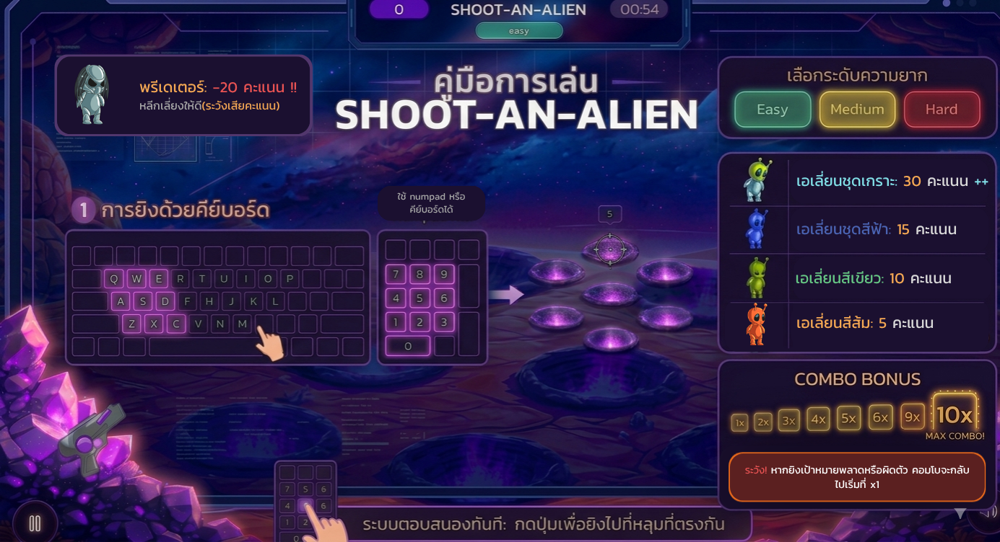

# 🎮 SHOOT-AN-ALIEN

เกมยิงเอเลี่ยนแบบ Reaction Game ที่พัฒนาโดยใช้ Vue 3  
ผู้เล่นต้องกดยิงเอเลี่ยนตามตำแหน่งที่ปรากฏให้เร็วและแม่นยำที่สุดภายในเวลาที่กำหนด ⏱️

---

## 🚀 Features

- 🎯 ยิงเอเลี่ยนด้วย Keyboard (QWE / ASD / ZXC หรือ Numpad)
- ⚡ ระบบ Combo เพิ่มคะแนนเมื่อยิงต่อเนื่อง
- 💥 เอฟเฟกต์ Flash และ Animation ยิง
- 🔊 Sound Effects (ยิง, โดน, พลาด, ลบคะแนน)
- 🎵 Background Music + ปุ่มเปิด/ปิดเสียง
- ⏸️ ระบบ Pause / Resume
- 🔁 Restart เกม
- ⏱️ Countdown Timer 1 นาที
- 🧠 Difficulty Levels (Easy / Medium / Hard)

---

## 🎮 Gameplay

- ยิงโดน → ได้คะแนน + Combo
- ยิงพลาด → Combo รีเซ็ต
- ยิงโดนตัวลบคะแนน → คะแนนลด
- Combo สูง → คะแนนคูณมากขึ้น

---

## 🛠️ Tech Stack

- Vue 3 (Composition API)
- Vite
- TailwindCSS
- JavaScript (ES6)

---

## 📂 Project Structure

```
src/
├── components/
│ ├── Alien.vue
│ ├── Blaster.vue
│ ├── Flash.vue
│ └── MuteButton.vue
│
├── composables/
│ ├── useAlienSpawner.js
│ ├── useKeyboardShoot.js
│ ├── useShoot.js
│ └── useAudio.js
│
├── views/
│ ├── GameView.vue
│ └── ResultView.vue
│
└── assets/
├── sprite/
└── sound/
```
---

## ▶️ How to Run

```bash
npm install
npm run dev
```
---
## 👾 How to Play



---

| 👤 Member         | 💼 Responsibility                                |
| ----------------- | ------------------------------------------------ |
| 👨‍💻 Wachitanan 034 |  UI / UX Design (layout, graphic ) and Document (how to play)        |
| 👩‍💻 Sahaphap 046 |  Game Logic (Shoot, Score, Combo System) & UI Animation พัฒนาและออกแบบระบบการยิง (shooting mechanic) รวมถึงการคำนวณคะแนน (score system) และระบบคอมโบ (combo system) โดยกำหนดเงื่อนไขการเพิ่มหรือล คะแนนตามประเภทและสีของเอเลี่ยนที่ถูกยิง นอกจากนี้ได้นำชุดภาพ sprite มาประยุกต์ใช้เพื่อสร้างแอนิเมชัน (animation) ให้กับตัวละครและเอฟเฟกต์ต่าง ๆ ภายในเกม เพื่อให้การแสดงผลมีความลื่นไหลและสมจริงยิ่งขึ้น |
| 👨‍💻 Ittiched 057 | Game Mechanics (spawn system, difficulty, timer)            |
| 👩‍💻 Panumed 107 | UI / UX Design (layout, responsive ) and Sound System (BGM, SFX, mute system)  |

---

📌 Notes
 - ใช้ Composition API เพื่อแยก logic เป็น modular (composables)
 - รองรับการเล่นทั้ง keyboard และ numpad

---

📷 Preview


---

🧑‍🎓 Developed for

INT250 CSS Framework SIT-KMUTT
